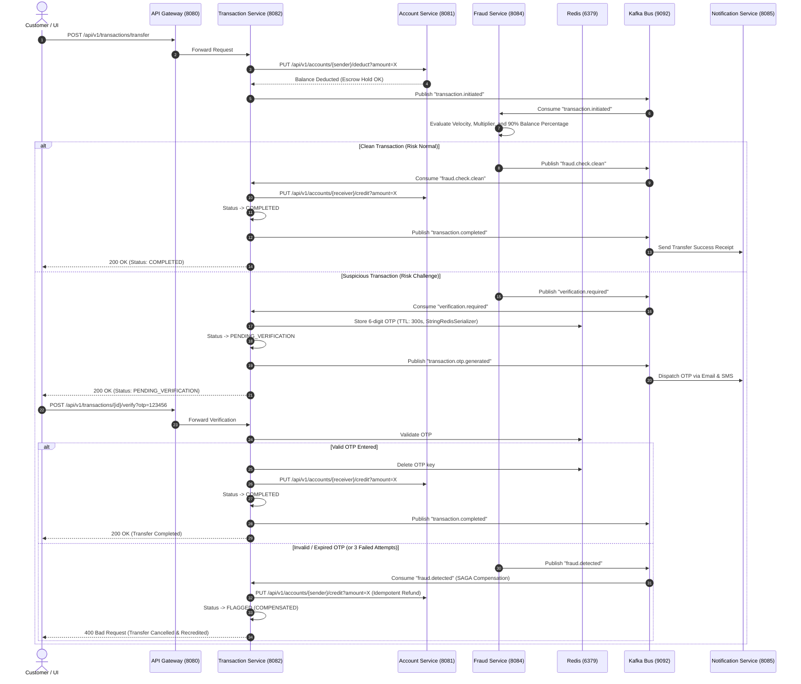

# Apex Digital Banking System

An event-driven, distributed **Digital Banking Platform & Executive Control Center** built with **Java 21**, **Spring Boot microservices**, **Apache Kafka**, **Redis**, **MySQL**, **Razorpay**, and a **React 19 (Vite)** frontend.

The platform provides complete end-to-end digital banking operations: customer onboarding and account ledgers, secure fund transfers governed by the **Distributed SAGA Pattern**, autonomous dynamic fraud detection, risk-triggered two-factor OTP verification, Razorpay payment processing with HMAC signature validation and idempotent compensations, asynchronous multi-channel notifications (Email/SMS), and a comprehensive **Executive Banking Control Center (Admin Portal)**.

---

## Overview

### What Problem Does This Project Solve?
Traditional monolithic banking systems struggle to scale independent financial domains (e.g., high-throughput transfer ledgers vs. intensive sliding-window fraud analytics) and maintain fault tolerance across external integrations (payment gateways, SMS/email relays).

This project demonstrates a production-grade, distributed, event-driven banking architecture where each financial domain is isolated into an independent microservice. It guarantees data consistency across services using distributed transaction patterns (**SAGA with Idempotent Compensation**) without locking distributed databases, protects customer assets with real-time risk scoring, and provides an enterprise-tier administrative banking control center.

### What the Application Does
- **For Retail Banking Customers**:
  - Open a digital bank account (Savings, Current, Fixed Deposit) with instant credential provisioning.
  - Sign in securely using JWT-based credentials or direct account access.
  - View real-time balances, detailed transaction histories, and security notification feeds.
  - Initiate peer-to-peer fund transfers with instant recipient verification and balance checks.
  - Complete high-risk or large transfers with a two-factor 6-digit OTP challenge.
  - Add funds or process checkout payments via integrated Razorpay gateway workflows.
- **For Banking Administrators (Executive Control Center)**:
  - **Executive Dashboard**: Real-time KPI telemetry (Users, Accounts, Vault Liquidity, SAGA Transfers, Razorpay Orders, Reconciled Refunds, Cluster Health).
  - **Idempotent Refund Hub**: Kafka-driven automated compensations, Razorpay refund reconciliation, zero-double-credit state machine tracking, and SAGA timeline inspectors.
  - **Dynamic Fraud Rules Engine**: In-memory dynamic rule modification (`velocity`, `multiplier`, `90% balance drain`) deployed without server restart, and live fraud anomaly event streaming.
  - **System Architecture & Telemetry**: Live TCP/HTTP port probing across all 7 microservices, Redis (:6379), Kafka (:9092), and MySQL (:3306) with real-time latency measurements.
  - **User Identity Registry**: Manage BCrypt (12 rounds) authenticated principals, roles (`ROLE_USER`, `ROLE_ADMIN`), and security credentials.
  - **Bank Accounts Ledger**: Inspect customer ledgers, daily velocity limits, and execute emergency account freeze/unblock actions.
  - **Transaction Audit Ledger**: Full audit trail of distributed transfers with step-by-step SAGA state inspection.
  - **Gateway Payments**: Razorpay order captures, webhook validations, and administrative manual refund execution.

---

## System Architecture

```mermaid
flowchart TB
    subgraph ClientLayer["Frontend Client Layer (React 19 / Vite)"]
        UI["Retail Customer Banking Portal\nhttp://localhost:5173"]
        ADMIN["Executive Banking Control Center\nhttp://localhost:5173/admin/*"]
    end

    subgraph GatewayLayer["API Gateway Layer (Spring Cloud Gateway)"]
        GW["API Gateway Service (Port 8080)\n- Route Predicates & Redis Rate Limiting\n- JwtAuthenticationFilter & Header Enrichment\n- GET /api/v1/system/health Telemetry Probe"]
    end

    subgraph CoreServices["Microservices Ecosystem (Java 21 / Spring Boot 3)"]
        AUTH["SpringSecEx (Port 8088)\nAuth & User Registry\n(JWT / BCrypt 12)"]
        ACC["Account Service (Port 8081)\nAccount Lifecycles & Ledgers\nDaily Limits & Freeze"]
        TXN["Transaction Service (Port 8082)\nSAGA Orchestrator & Transfer Engine\nIdempotent Compensation"]
        PAY["Payment Service (Port 8083)\nRazorpay Gateway, HMAC Webhooks\nIdempotent Refunds"]
        FRAUD["Fraud Detection Service (Port 8084)\nDynamic Rule Engine, Redis Sliding Window\nGET/PUT /api/v1/fraud/rules"]
        NOTIF["Notification Service (Port 8085)\nEmail (SMTP) & Multi-Channel SMS"]
    end

    subgraph PersistenceLayer["Data & Messaging Infrastructure"]
        MYSQL[("MySQL 8.0 (Port 3306)\nauth_db | account_db | payment_db")]
        REDIS[("Redis 7.0 (Port 6379)\nStringRedisSerializer\nOTP Storage (300s) | Velocity Checks (60s)")]
        KAFKA{{"Apache Kafka + Zookeeper (Ports 9092 / 2181)\nAsynchronous SAGA Event Bus"}}
    end

    UI -->|REST / JSON| GW
    ADMIN -->|REST / JWT| GW

    GW -->|/api/v1/auth/**| AUTH
    GW -->|/api/v1/accounts/**| ACC
    GW -->|/api/v1/transactions/**| TXN
    GW -->|/api/v1/payments/**| PAY
    GW -->|/api/v1/fraud/**| FRAUD
    GW -->|/api/v1/notifications/**| NOTIF

    AUTH -->|JPA| MYSQL
    ACC -->|JPA| MYSQL
    PAY -->|JPA| MYSQL
    TXN -->|JPA| MYSQL

    TXN -.->|REST / OpenFeign| ACC
    FRAUD -.->|REST / OpenFeign| ACC
    PAY -.->|REST / OpenFeign| ACC

    TXN -->|OTP Keys (300s)| REDIS
    FRAUD -->|Sliding Velocity (60s)| REDIS
    GW -->|Rate Limiter Keys| REDIS

    TXN -->|transaction.initiated| KAFKA
    FRAUD -->|fraud.check.clean / verification.required / fraud.detected| KAFKA
    PAY -->|payment.refund.required| KAFKA
    KAFKA -->|Consume| FRAUD
    KAFKA -->|Consume| TXN
    KAFKA -->|Consume| ACC
    KAFKA -->|Consume| NOTIF
```

---

## Microservices & Infrastructure Matrix

| Service / Node | Port | Protocol / Technology | Gateway Route | Core Role |
|---|---|---|---|---|
| **API Gateway** | `8080` | HTTP / Spring Cloud Gateway | `/api/v1/**` | JWT Security Filter, Redis Rate Limiting, Health Aggregator (`/system/health`) |
| **SpringSecEx (Auth)** | `8088` | HTTP / Spring Security | `/api/v1/auth/**` | BCrypt (12 rounds) Hashing, JWT Minting, User Registry |
| **Account Service** | `8081` | HTTP / Kafka / JPA | `/api/v1/accounts/**` | Account Creation, Balance Ledger, Limits, Freeze/Unblock Actions |
| **Transaction Service** | `8082` | HTTP / Kafka / JPA | `/api/v1/transactions/**` | SAGA Orchestrator, Transfer Ledger, OTP Challenge, Idempotent Compensations |
| **Payment Service** | `8083` | HTTP / Kafka / Razorpay | `/api/v1/payments/**` | Razorpay Checkout, Webhook Captures, Idempotent Gateway Refunds |
| **Fraud Detection Service** | `8084` | Kafka / Redis / Feign | `/api/v1/fraud/**` | Dynamic Rules Engine (`5/min`, `5x spike`, `90% drain`), Live Event Telemetry |
| **Notification Service** | `8085` | Kafka / JavaMail / SMS | `/api/v1/notifications/**` | Multi-channel OTP Delivery, Email Alerts, Refund Notices |
| **Redis Cache** | `6379` | TCP / Redis Protocol | In-Memory | OTP TTL (5m), Velocity Counters (60s), Rate Limiting (`StringRedisSerializer`) |
| **Apache Kafka Broker** | `9092` | TCP / PLAINTEXT | Event Bus | Asynchronous SAGA Distributed Event Streaming |
| **MySQL Database** | `3306` | JDBC / MySQL 8.0 | Relational ACID | Multi-database Ledgers (`auth_db`, `account_db`, `payment_db`) |

---

## Core Business Workflows

### 1. Distributed SAGA Fund Transfer & Idempotent Compensation



---

## Fraud Detection Rules Engine

The `fraud-detection-service` evaluates transfers in real-time and supports **dynamic runtime rule reconfiguration without service restarts**:

1. **Velocity Rule (`max-transaction-per-minute: 5`)**:
   - Tracks the count of transfers per account in a rolling 60-second window in Redis (`fraud:velocity:{accountNumber}`).
   - If velocity exceeds 5 transactions/minute, triggers mandatory 2FA verification.
2. **Amount Spike Multiplier (`suspicious-amount-multiplier: 5.0`)**:
   - Compares the transfer amount against the customer's historical average (`fraud:avg_amount:{accountNumber}`).
   - If transfer is $\ge 5\times$ rolling average, flags as anomaly.
3. **High Balance Depletion (`max-balance-percentage: 0.90`)**:
   - Queries `account-service` via OpenFeign with `@PathVariable("accountNumber")`.
   - Transfers exceeding 90% of available account balance trigger 2FA challenge.
4. **Dynamic Rule Management Endpoints**:
   - `GET /api/v1/fraud/rules` — View active rule thresholds.
   - `PUT /api/v1/fraud/rules` — Update thresholds dynamically in memory across cluster nodes.
   - `GET /api/v1/fraud/events` — Live stream of recent fraud interceptions and risk scores.

---

## Executive Banking Control Center (Admin Portal)

The frontend includes a dedicated administrative suite built with reusable components (`frontend/src/components/admin/`):

- **`AdminDashboard`** (`/admin/dashboard`): Real-time metrics grid, live cluster health status, recent transactions & payment tables, domain portal shortcuts.
- **`AdminRefunds`** (`/admin/refunds`): Idempotent Refund Hub, SAGA compensation tracking, Razorpay refund IDs, step-by-step SAGA Activity Timeline inspector (`AdminActivityTimeline`).
- **`AdminFraud`** (`/admin/fraud`): Active rule cards, dynamic rule configuration modal, live fraud event stream with risk scores and actions taken.
- **`AdminSystem`** (`/admin/system`): Real-time network topology probing (`GET /api/v1/system/health`), latency indicators (ms), port mapping matrix, auto-probe toggle.
- **`AdminUsers`** (`/admin/users`): User identity store, BCrypt credential status, role authority filtering (`ROLE_ADMIN` vs `ROLE_USER`).
- **`AdminAccounts`** (`/admin/accounts`): Customer ledgers, account types, balances, daily limits, and emergency `AdminConfirmDialog` for freeze/unblock actions.
- **`AdminTransactions`** (`/admin/transactions`): SAGA audit trail with filter chips (`COMPLETED`, `PENDING_VERIFICATION`, `FLAGGED`, `FAILED`) and SAGA flow inspector.
- **`AdminPayments`** (`/admin/payments`): Razorpay gateway order registry, HMAC verification tracking, and manual administrative refund trigger modal.

---

## Kafka Topics Specification

| Topic Name | Producer | Consumer(s) | Purpose |
|---|---|---|---|
| `transaction.initiated` | `transaction-service` | `fraud-detection-service` | Notifies that sender funds are held and ready for risk scoring |
| `fraud.check.clean` | `fraud-detection-service` | `transaction-service` | Approves immediate transfer and credits recipient |
| `verification.required` | `fraud-detection-service` | `transaction-service`, `notification-service` | Challenges transfer; generates and dispatches 6-digit OTP |
| `fraud.detected` | `fraud-detection-service` | `transaction-service`, `notification-service` | Triggers SAGA compensating transaction (refunds sender balance) |
| `transaction.completed` | `transaction-service` | `account-service`, `notification-service` | Finalizes transaction and sends customer receipt |
| `payment.refund.required` | `transaction-service` / `payment-service` | `payment-service` | Dispatches automated Razorpay gateway refund |

---

## Redis Key Strategy & Serializers

All Redis operations utilize `StringRedisSerializer` to eliminate binary JDK serialization corruption:

| Key Pattern | Data Structure | TTL | Purpose |
|---|---|---|---|
| `otp:{accountNumber}` | String | 300 seconds (5 min) | 6-digit OTP code for 2FA challenge |
| `otp_attempts:{accountNumber}` | Integer | 300 seconds (5 min) | Max 3 invalid attempts before lockout |
| `fraud:velocity:{accountNumber}` | Integer | 60 seconds (1 min) | Rolling counter of transfers executed per minute |
| `fraud:avg_amount:{accountNumber}` | String / Float | 86400s (24 hrs) | Customer historical average transfer baseline |
| `rate:limit:ip:{ipAddress}` | Integer | 1 second | Gateway route protection |

---

## REST API Reference

All client requests route through the API Gateway at `http://localhost:8080`.

### System Telemetry & Cluster Health (`api-gateway-service` &rarr; `/api/v1/system/**`)
| Method | Endpoint | Access | Description |
|---|---|---|---|
| `GET` | `/api/v1/system/health` | `ROLE_ADMIN` | Probes all 7 microservices, Redis, Kafka, and MySQL with latency metrics |

### Authentication Endpoints (`SpringSecEx` &rarr; `/api/v1/auth/**`)
| Method | Endpoint | Access | Description |
|---|---|---|---|
| `POST` | `/api/v1/auth/register` | Public | Register new customer account (assigns `ROLE_USER`) |
| `POST` | `/api/v1/auth/login` | Public | Authenticate; returns HMAC-SHA384 signed JWT token |
| `GET` | `/api/v1/auth/me` | Authenticated | Retrieve current user profile and role |
| `GET` | `/api/v1/auth/users` | `ROLE_ADMIN` | Retrieve all registered users |

### Account Endpoints (`account-service` &rarr; `/api/v1/accounts/**`)
| Method | Endpoint | Access | Description |
|---|---|---|---|
| `POST` | `/api/v1/accounts` | Public | Create new bank account with initial deposit |
| `GET` | `/api/v1/accounts` | `ROLE_ADMIN` | Retrieve all bank accounts |
| `GET` | `/api/v1/accounts/{accountNumber}` | Authenticated | Get account details by account number |
| `GET` | `/api/v1/accounts/{accountNumber}/balance` | Authenticated | Get real-time available balance |
| `PUT` | `/api/v1/accounts/{accountNumber}/block` | `ROLE_ADMIN` | Freeze an account |
| `PUT` | `/api/v1/accounts/{accountNumber}/unblock` | `ROLE_ADMIN` | Restore an account |
| `PUT` | `/api/v1/accounts/{accountNumber}/deduct` | Internal / Saga | Deduct balance (Step 1 of transfer Saga) |
| `PUT` | `/api/v1/accounts/{accountNumber}/credit` | Internal / Saga | Credit balance (Step 4 of transfer Saga / refund) |

### Transaction Endpoints (`transaction-service` &rarr; `/api/v1/transactions/**`)
| Method | Endpoint | Access | Description |
|---|---|---|---|
| `POST` | `/api/v1/transactions/transfer` | Authenticated | Initiate distributed fund transfer |
| `GET` | `/api/v1/transactions` | `ROLE_ADMIN` | Retrieve all transactions across the bank |
| `GET` | `/api/v1/transactions/{transactionId}` | Authenticated | Get real-time status of a transaction |
| `POST` | `/api/v1/transactions/{transactionId}/verify` | Authenticated | Submit 6-digit OTP to verify transfer |
| `POST` | `/api/v1/transactions/{transactionId}/resend-otp` | Authenticated | Request fresh OTP |
| `POST` | `/api/v1/transactions/{transactionId}/cancel` | Authenticated | Cancel pending transaction & trigger SAGA refund |

### Payment Endpoints (`payment-service` &rarr; `/api/v1/payments/**`)
| Method | Endpoint | Access | Description |
|---|---|---|---|
| `POST` | `/api/v1/payments` | Authenticated | Create a Razorpay payment order |
| `GET` | `/api/v1/payments` | `ROLE_ADMIN` | Retrieve all payment records |
| `POST` | `/api/v1/payments/verify-signature` | Authenticated | Validate Razorpay HMAC-SHA256 signature |
| `POST` | `/api/v1/payments/webhook` | Public | Razorpay webhook callback listener |
| `POST` | `/api/v1/payments/{paymentId}/refund` | `ROLE_ADMIN` | Trigger administrative gateway refund |

### Fraud Detection Endpoints (`fraud-detection-service` &rarr; `/api/v1/fraud/**`)
| Method | Endpoint | Access | Description |
|---|---|---|---|
| `GET` | `/api/v1/fraud/rules` | `ROLE_ADMIN` | Retrieve active fraud rules, velocity limits, and risk multipliers |
| `PUT` | `/api/v1/fraud/rules` | `ROLE_ADMIN` | Dynamically modify fraud rule thresholds in memory |
| `GET` | `/api/v1/fraud/events` | `ROLE_ADMIN` | Live stream of recent fraud interceptions |

---

## Tech Stack

### Backend
- **Language**: Java 21 LTS
- **Framework**: Spring Boot 3.x / Spring Cloud 2025.x
- **Modules**: Spring WebFlux (Gateway), Spring Security, Spring Data JPA, OpenFeign, Spring Mail
- **Security**: JWT (HMAC-SHA384), BCrypt (12 rounds)
- **Message Broker**: Apache Kafka 7.4.0 with Zookeeper
- **Caching & In-Memory Storage**: Redis 7.0 (Lettuce client with `StringRedisSerializer`)
- **Relational Database**: MySQL 8.0
- **Build Tool**: Apache Maven (`mvn`)

### Frontend
- **Framework**: React 19 / Vite 6
- **Routing**: React Router DOM 6
- **HTTP Client**: Axios with centralized request & response interceptors
- **Styling**: Vanilla CSS3 Design System with Custom Properties & Dark Mode Elements
- **Component Library**: Custom Reusable Admin UI Suite (`components/admin/`)

---

## Repository Structure

```
digital-banking-system/
├── backend/
│   ├── account-service/            # Account lifecycles, ledgers, atomic debit/credit
│   ├── api-gateway-service/        # Spring Cloud Gateway, JWT filter, /system/health telemetry
│   ├── fraud-detection-service/    # Dynamic rule engine, sliding Redis window, live events
│   ├── notification-service/       # Kafka event consumer for SMTP Email & SMS alerts
│   ├── payment-service/            # Razorpay payment gateway integration, HMAC signature, refunds
│   ├── SpringSecEx/                # Authentication service (JWT, BCrypt 12, user registry)
│   ├── transaction-service/        # SAGA orchestrator, idempotent compensation, Redis OTP
│   └── docker-compose.yml          # Container definitions for MySQL, Redis, Kafka, Zookeeper
├── frontend/
│   ├── src/
│   │   ├── api/                    # Centralized adminApi & client modules
│   │   ├── components/             # Reusable UI & Navbar/Sidebar
│   │   │   └── admin/              # Complete Reusable Admin Component Library (24 components)
│   │   ├── pages/                  # Retail customer pages (Login, Register, Dashboard, Transfer)
│   │   │   └── admin/              # Admin pages (Dashboard, Refunds, Fraud, System, Users, Accounts, Tx, Pay)
│   │   └── styles/                 # CSS Design System (global, dashboard, forms, transactions)
│   ├── package.json
│   └── vite.config.js
├── docs/                           # Architectural diagrams and PDF implementation specifications
└── README.md
```

---

## Local Setup & Development Guide

### Prerequisites
- **Java 21 LTS** (`java -version`)
- **Node.js v18+** (`node -v`)
- **Docker & Docker Compose** (`docker compose version`)
- **Maven 3.9+** (`mvn -v`)

---

### Step 1: Start Infrastructure Containers
```bash
cd backend
docker compose up -d
```
Starts MySQL 8.0 (`:3306`), Redis 7.0 (`:6379`), Zookeeper (`:2181`), and Apache Kafka (`:9092`).

---

### Step 2: Start Backend Microservices
Run each service from separate terminals:

```bash
# 1. API Gateway Service (Port 8080)
cd backend/api-gateway-service && mvn spring-boot:run

# 2. Auth Service (Port 8088)
cd backend/SpringSecEx && mvn spring-boot:run

# 3. Account Service (Port 8081)
cd backend/account-service && mvn spring-boot:run

# 4. Transaction Service (Port 8082)
cd backend/transaction-service && mvn spring-boot:run

# 5. Payment Service (Port 8083)
cd backend/payment-service && mvn spring-boot:run

# 6. Fraud Detection Service (Port 8084)
cd backend/fraud-detection-service && mvn spring-boot:run

# 7. Notification Service (Port 8085)
cd backend/notification-service && mvn spring-boot:run
```

---

### Step 3: Start the Frontend Application
```bash
cd frontend
npm install
npm run dev
```
Navigate to **[http://localhost:5173](http://localhost:5173)** in your browser.

---

### Default Credentials

| Role | Username | Password | Email | Access Route |
|---|---|---|---|---|
| **System Administrator** | `admin` | `Admin@12345` | `admin@bank.local` | `/admin/dashboard` |
| **Retail Customer** | Self-registered via UI | Min 6 characters | Customer email | `/` |

---

## Testing & Verification

```bash
# Verify backend microservices
cd backend/fraud-detection-service && mvn clean test
cd backend/transaction-service && mvn clean test
cd backend/payment-service && mvn clean test
cd backend/SpringSecEx && mvn clean test
cd backend/notification-service && mvn clean test
cd backend/account-service && mvn clean test
cd backend/api-gateway-service && mvn clean test

# Verify frontend build
cd frontend && npm run build
```

---

## Author & License

**Shiva Jinkalker**
- GitHub: [@Jinkalkershiva](https://github.com/Jinkalkershiva)
- Repository: [Jinkalkershiva/digital-banking-system](https://github.com/Jinkalkershiva/digital-banking-system)

Licensed under the **MIT License**.
